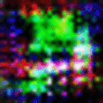

# Mozart

  

This is the code behind the project [Mozart](https://sidpremkumar.com/mozGan_v1.html). Check out my website to learn more about what I'm trying to do.

## Getting Started
The code developed is not very easy to run standalone. You have to first convert the images then modify the code to run the AC-GAN.
Take a look at MozGan2.py to get started. It is pretty well documented.

You should be running the program on a GPU if you can, otherwise it will end up taking a very long time. Especially if you are using images larger than 28x28x1

### neutral_style_transfer.py
This is the code behind the neural style transfer. This is used to stylize the input images for the AC-GAN

### mozGan2.py
This is the code behind Mozart. This program can stylize the inputs, and then after taking the code can load in the converted images.

### blend_images.py, get_background.py, select_most_interesting_thing.py
These are works in progress. I am trying to develop code to select the most interesting thing in an image

## Aknowlegments
* [AC-GAN in Keras](https://github.com/lukedeo/keras-acgan/blob/master/mnist_acgan.py)
* [Neural Style Transfer](https://medium.com/tensorflow/neural-style-transfer-creating-art-with-deep-learning-using-tf-keras-and-eager-execution-7d541ac31398)
